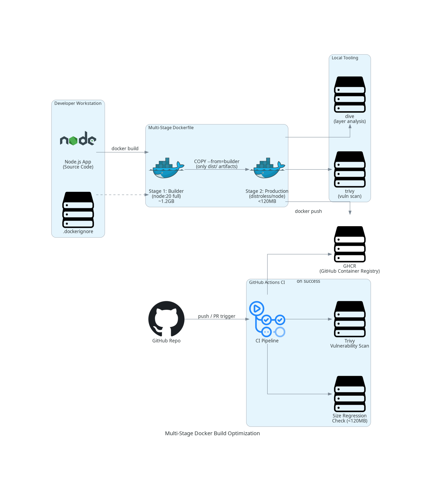
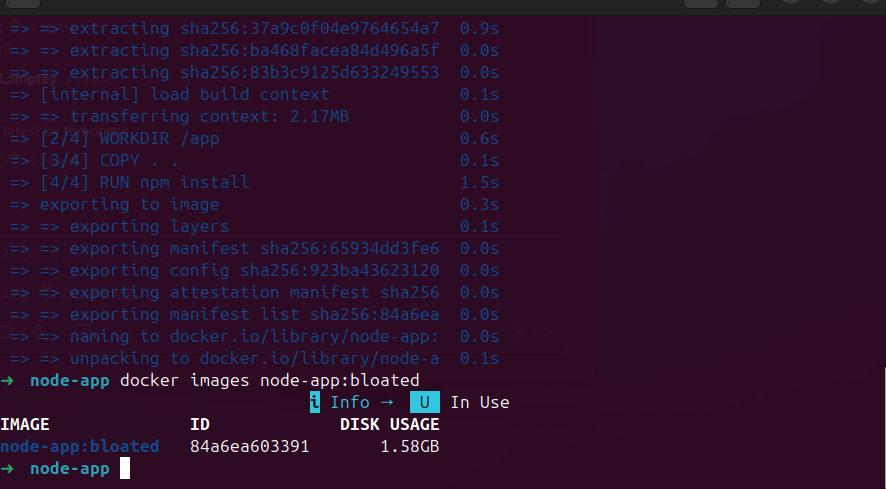
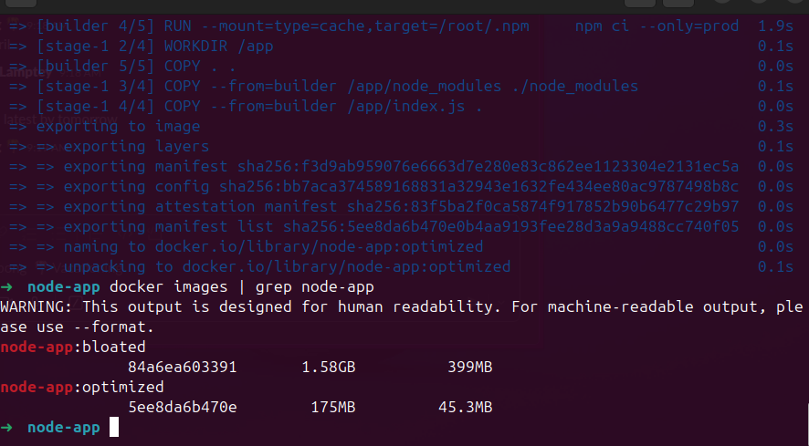
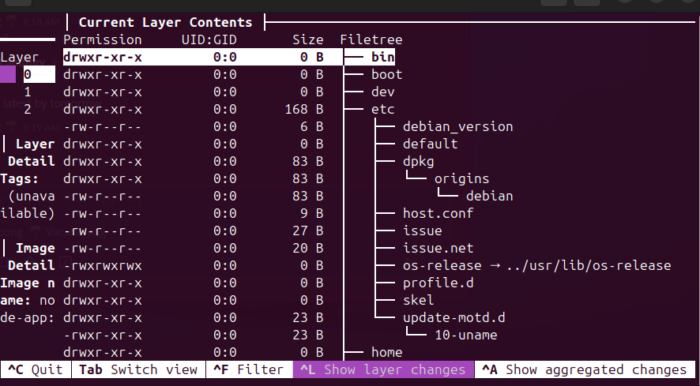

# Lab 02 — Multi-Stage Docker Build Optimization

Shrink a bloated ~1.2GB Node.js container image to under 120MB using multi-stage builds, distroless base images, BuildKit cache mounts, and automated CI size regression detection.

---

## Architecture



---

## Results

### Before — Bloated Single-Stage Image (~1.2GB)



### After — Optimized Multi-Stage Image (<120MB)



### Layer Analysis with `dive`



---

## What Was Done

| Technique | Why |
|-----------|-----|
| Multi-stage build | Build tools and intermediate files never enter the final image |
| Distroless base image (`gcr.io/distroless/nodejs20`) | No shell, no OS utilities — minimal attack surface and size |
| `npm ci --only=production` | Strips devDependencies from the production image |
| BuildKit cache mounts | npm packages cached on host — no re-downloads on rebuild |
| `.dockerignore` | Prevents `node_modules`, `.git`, and local files entering the build context |
| Layer ordering (deps before source) | Unchanged dependency layers are reused from Docker cache |

**End result: ~90% image size reduction**

---

## Project Structure

```
.
├── node-app/
│   ├── .dockerignore
│   ├── .github/
│   │   └── workflows/
│   │       └── docker.yml       # CI pipeline: build → size check → scan → push
│   ├── Dockerfile               # Optimized multi-stage build
│   ├── Dockerfile.bloated       # Baseline single-stage build
│   ├── index.js
│   ├── package.json
│   └── package-lock.json
├── screenshots/
│   ├── bloated-image.png
│   ├── optimized-image.png
│   └── dive.png
├── architecture.png             # Architecture diagram
├── architecture_diagram.py      # Diagram source (diagrams library)
├── GUIDE.md                     # Full step-by-step guide with explanations
└── README.md
```

---

## CI Pipeline (GitHub Actions)

The workflow in `.github/workflows/docker.yml` does the following on every push/PR:

1. Builds the image using BuildKit with GitHub Actions layer caching
2. Checks image size — fails if it exceeds 120MB (regression gate)
3. Scans for HIGH/CRITICAL CVEs using Trivy
4. Pushes to GitHub Container Registry (GHCR) on merge to `main`

---

## Tools Used

- [Docker BuildKit](https://docs.docker.com/build/buildkit/)
- [Distroless Images](https://github.com/GoogleContainerTools/distroless)
- [dive](https://github.com/wagoodman/dive) — image layer inspector
- [Trivy](https://github.com/aquasecurity/trivy) — vulnerability scanner
- [GitHub Actions](https://docs.github.com/en/actions)
- [GHCR](https://docs.github.com/en/packages/working-with-a-github-packages-registry/working-with-the-container-registry)

---

## Full Guide

See [GUIDE.md](GUIDE.md) for the complete step-by-step walkthrough with command explanations.
